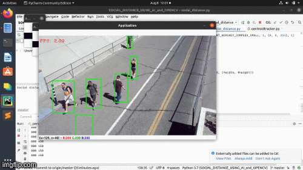

PROJECT NAME  

# Social Distance Detection using OpenCV and AI 

 

### OVERVIEW 

Social Distancing – the term that has taken the world by storm and is transforming the way we live. Social distancing has become a mantra around the world, transcending languages and cultures. 

COVID-19 outbreak has created a lot of tension and misery to many families across the globe. During this pandemic, people are advised to not be in close contact with others to reduce the spread of the disease. But there are still many humans who are negligent about this disease by not maintaining social distance.  

### PROJECT GOAL 

    So, I developed this project to monitor if people are maintaining social distance or not. 

    This can help the Government monitor areas where social distancing is not practiced, enforce stricter laws and alert them if the situation turns serious. 

    Further we can connect it with speech or alarm process to tell people maintain proper distance. 

### Specifications 

Here in this project we will be using OPENCV and Artificial Intelligence. 

Webcam is used to capture the video and detect people in real-time. If people are very close to each other, a red bounding box is displayed around them indicating that they are not maintaining social distance. 

## Final working of project

